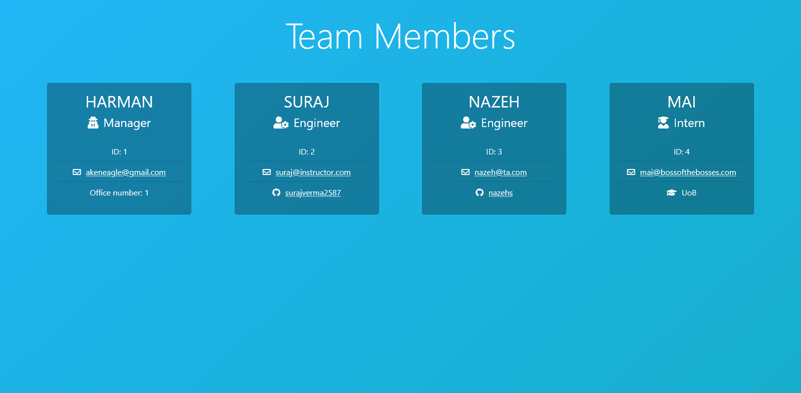

# Team Profile Generator 

## Table of Contents
  
  - [Description](#description)
- [Installation](#installation)
- [Usage](#usage)
- [Testing](#testing)

- [License](#license)
- [Contact](#contact)
- [Contributing](#contributing)
- [Preview](#preview)
  
## Description

With this application you can create a website that shows your team members info.
  
## Installation
  
Run the following script to install the packages required for the application:
      
```
Download this repository in a new folder
```

## Testing
    
To test the application:
        
```
Use the command npm run test
```

## Usage
  
To use the application run the following script:
      
```
Open a new terminal in the folder and use the command npm run start
```
  
## Contributing

To contribute the project:

```
You can fork this repository and make changes.
```
  
## License
  
MIT

## Questions
    
GitHub: [akeneagle](https://github.com/akeneagle)\
Email: akeneagle@gmail.com

## Preview



## [Walkthrough video](https://drive.google.com/file/d/19I-PyoE21KRJJ72OWczyPSj4kmEStQ1Y/view?usp=sharing)
